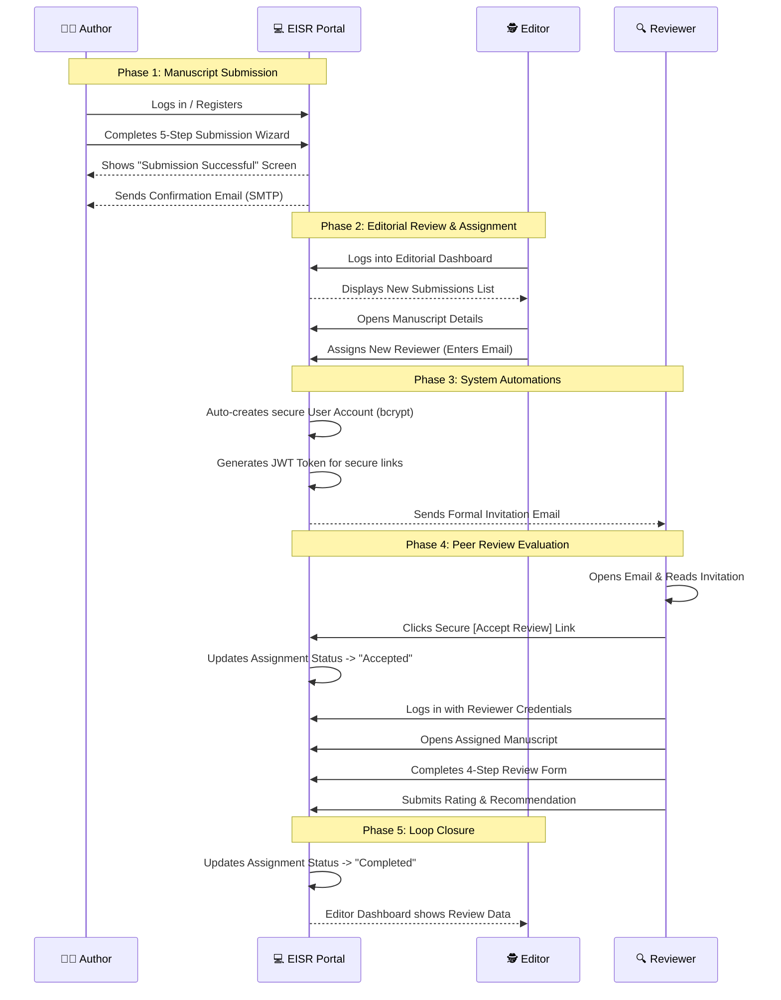
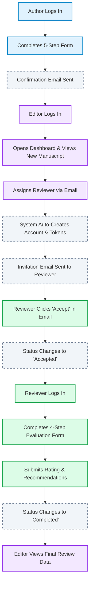

# EISR Portal - Editorial Workflow Demonstration Flow

This diagram illustrates the step-by-step process of a manuscript's journey through the EISR Academic Publishing Portal, from initial submission by the Author to final evaluation by the Reviewer.

## Detailed Flowchart

